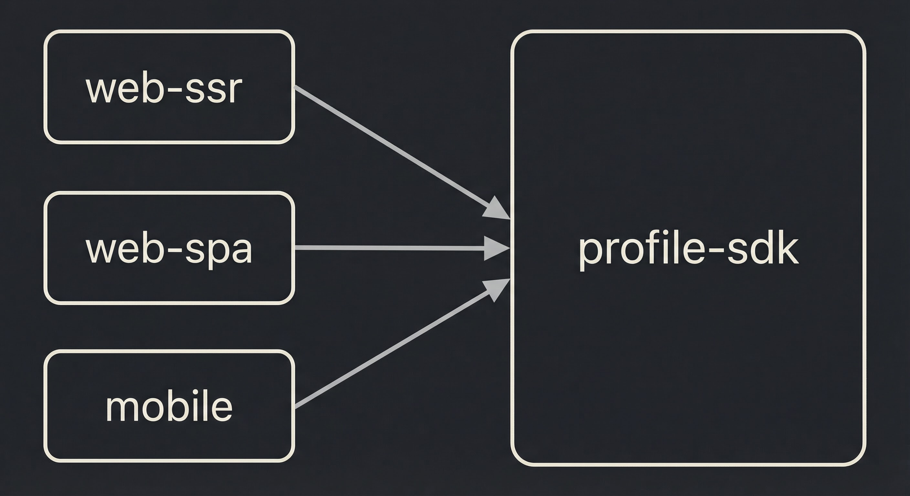

# Erasys Gallery

An Nx monorepo containing a **Next.js SSR app**, a **React SPA**, a **React Native (mobile) app**, and a **shared profile SDK** — all in TypeScript (web apps use Tailwind CSS).

## Project structure

The dependency graph (apps depend on the shared `profile-sdk`; no coupling between apps):



To explore the full graph interactively, run: `npx nx graph`.

## Quick Start

```bash
# Install dependencies
npm install

# Start the SSR app (http://localhost:3000)
npx nx dev web-ssr

# Start the SPA (http://localhost:4200)
npx nx dev web-spa

# Start the mobile app in the browser (http://localhost:4201)
npx nx dev mobile

# Run shared library tests
npx nx test profile-sdk

# Run tests with coverage
npx nx test profile-sdk --coverage
```

## Key Commands

| Command                     | Description                                    |
| --------------------------- | ---------------------------------------------- |
| `npx nx dev web-ssr`        | Start Next.js dev server (port 3000)           |
| `npx nx dev web-spa`        | Start Vite dev server (port 4200)              |
| `npx nx dev mobile`         | Start mobile app in browser via Vite (4201)    |
| `npx nx start mobile`       | Start Metro bundler (for iOS/Android only)     |
| `npx nx run-ios mobile`     | Run on iOS simulator (after `start mobile`)    |
| `npx nx run-android mobile` | Run on Android emulator (after `start mobile`) |
| `npx nx build web-ssr`      | Production build (SSR)                         |
| `npx nx build web-spa`      | Production build (SPA)                         |
| `npx nx build mobile`       | Production web build for mobile (Vite)         |
| `npx nx test profile-sdk`   | Run shared library tests                       |
| `npx nx lint <project>`     | Lint a project                                 |
| `npx nx graph`              | Visualize project dependency graph             |

**Mobile app:** Use `npx nx dev mobile` to run in the browser (react-native-web). For a real device or simulator, run `npx nx start mobile` in one terminal, then `npx nx run-ios mobile` or `npx nx run-android mobile` in another.

## Environment Variables

Copy `.env.example` to `.env.local` in each app directory:

| Variable            | App     | Description                                                        |
| ------------------- | ------- | ------------------------------------------------------------------ |
| `API_BASE_URL`      | web-ssr | External API origin (default: `https://www.hunqz.com`)             |
| `VITE_API_BASE_URL` | web-spa | API base URL; empty in dev (Vite proxy), set to SSR origin in prod |

## Documentation

- [Architecture Overview](docs/architecture.md)
- [CORS Strategy](docs/cors-strategy.md)
- [Development Guide](docs/development-guide.md)
- [Profile SDK](docs/profile-sdk.md)
- [Mobile App](docs/mobile-app.md)

## Tech Stack

- **Monorepo**: Nx 22
- **SSR**: Next.js 16 (App Router, Server Components)
- **SPA**: React 19, Vite, React Router
- **Mobile**: React Native, Vite (web) / Metro (native), react-native-web
- **Shared**: TypeScript, Jest, SWC, `@erasys/profile-sdk`
- **Styling**: Tailwind CSS 3 (web), StyleSheet (mobile)
- **Linting**: ESLint 9, Prettier

## TODO

Possible next steps and improvements for the project:

- **Shared UI** — Extract common components (cards, layout, image gallery) into a shared package consumed by web-ssr and web-spa.
- **Testing** — Add E2E tests (e.g. Playwright for web, Detox or Maestro for mobile); add unit tests for web-ssr/web-spa components.
- **CI/CD** — Run `nx build`, `nx test`, and `nx lint` in CI (e.g. GitHub Actions); add deploy pipelines for web-ssr, web-spa, and mobile.
- **Error handling & loading** — Shared error boundaries and loading states across apps; retry logic and offline handling for the SDK.
- **Accessibility** — Audit with axe or Lighthouse; improve focus order, ARIA, and keyboard navigation.
- **Performance** — Image placeholders/skeleton in profile-sdk or apps; consider ISR or caching for SSR profile pages.
- **SEO & analytics** — Sitemap/robots already in place; add analytics and optional structured data for profiles.
- **i18n** — If multiple locales are needed, add a shared i18n package or use framework-specific solutions (next-intl, react-i18next).
- **Monitoring** — Error reporting (e.g. Sentry) and basic health checks for the SSR API route.
